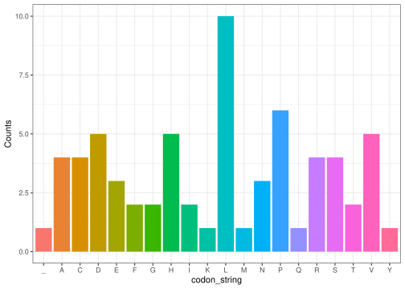

## AnalysisCD Package

The AnalysisCD package can be used to analyse a DNA sequence in regards
to the central dogma. The package includes a set of functions, which all
are a part of translating DNA to amino acids. This includes creating DNA
sequences, translating it to RNA, translate RNA to Codons, translate
Codons to amino acids and plotting the results of the analysis.

## Installation

``` r
devtools::install_github("/sahandyz/group_26_package")
```

## Usage

``` r
library(AnalysisCD)
#> Loading required package: ggplot2
#> Loading required package: stringr
```

#### Creating a random DNA sequence

We generate a random DNA sequence by sampling a string of ATCGs. In the
function, a string is generated with the ‘replica’ parameter set to
‘true.’ This means the sequence may not have an equal number of bases.
The function takes a numerical input, representing the desired length of
the DNA sequence. This function is essential because it rapidly
generates new random strings that can serve as input for other
functions. Since the user can determine the length, it provides the
flexibility to create short, easily readable sequences. Experimenting
with short sequences as input for other functions can help in
understanding the outcomes better. Conversely, creating a long string
makes it more realistic and representative of real-life scenarios.

``` r
dna_string <- dna_sequence(200)
dna_string
#> [1] "TCAGCCAACACGGCATCTCCCAGCGCCGATCTTGTACAGCATGATCCTCCCGGCGAGGGTGGTTCTGATCTTCACAGACTCTCCCTTGACTTTTATGATGGTTCAGCTGCATTGGCAGTCGAATCACACGAATCGAATTAGCATGGCCGTAAGACTCTGGCAGGCGTTCTTCGCAACCGCCACCAATTGTGGACTGGGCC"
```

#### Converting DNA to RNA

The replace_T\_with_U function transforms a given DNA sequence by
replacing thymine (T) with uracil (U). It takes a string as input and
returns a new string with all ’T’s replaced by ’U’s. This conversion is
crucial in the context of central dogma as it prepares the DNA sequence
for further translation into RNA, allowing for accurate amino acid
sequence determination.

``` r
rna_string <- replace_T_with_U(dna_string)
rna_string
#> [1] "UCAGCCAACACGGCAUCUCCCAGCGCCGAUCUUGUACAGCAUGAUCCUCCCGGCGAGGGUGGUUCUGAUCUUCACAGACUCUCCCUUGACUUUUAUGAUGGUUCAGCUGCAUUGGCAGUCGAAUCACACGAAUCGAAUUAGCAUGGCCGUAAGACUCUGGCAGGCGUUCUUCGCAACCGCCACCAAUUGUGGACUGGGCC"
```

#### Transforming RNA to codons

The function get_codons can be used to translate RNA to codons. The
input is a string containing an RNA sequence and the numeric value of
the first base pair in the string to be counted (the default is 1). The
function count the length of the string and splits them by 3. It returns
a list of strings which contains the codons.

``` r
codons <- get_codons(rna_string)
codons
#>  [1] "UCA" "GCC" "AAC" "ACG" "GCA" "UCU" "CCC" "AGC" "GCC" "GAU" "CUU" "GUA"
#> [13] "CAG" "CAU" "GAU" "CCU" "CCC" "GGC" "GAG" "GGU" "GGU" "UCU" "GAU" "CUU"
#> [25] "CAC" "AGA" "CUC" "UCC" "CUU" "GAC" "UUU" "UAU" "GAU" "GGU" "UCA" "GCU"
#> [37] "GCA" "UUG" "GCA" "GUC" "GAA" "UCA" "CAC" "GAA" "UCG" "AAU" "UAG" "CAU"
#> [49] "GGC" "CGU" "AAG" "ACU" "CUG" "GCA" "GGC" "GUU" "CUU" "CGC" "AAC" "CGC"
#> [61] "CAC" "CAA" "UUG" "UGG" "ACU" "GGG"
```

#### Translation of codons to peptide

The function codons_to_aa_sequence can be used to translate codons to a
peptide. The input is a list with 3-letter codons as strings which are
translated using the `codon_table` which is also found in the package.
After translation the function returns a string of amino acids. This
means that the result from the get_codons functions can be used as input
and the results from codons_to_aa_sequence can be used for the
plot_codons function.

``` r

codons_str <- codons_to_aa_sequence(codons)
codons_str
#> [1] "SANTASPSADLVQHDPPGEGGSDLHRLSLDFYDGSAALAVESHESN_HGRKTLAGVLRNRHQLWTG"
```

#### Plotting the amino acids

The last function of the package is the plot_codons function. It takes a
string of codons without space as parameter. An example could be this:
“VADEGTSNK”. This plots the codons generated by the former functions, in
a nice way. Alternatively, a string of codons gathered from elsewhere
can also be used in the function.

``` r
plot_codons(codons_str)
```



### Discussion

Keeping the number of dependencies low in an R package is a good idea
because it makes package maintenance easier, improves package stability,
speeds up installations, and gives you better control over what your
package does. Having fewer dependencies makes your package more reliable
and secure, reducing the chances of problems and conflicts with other
packages. There are certain scenarios where you can’t avoid having more
dependencies. If your package is meant to work with other packages or
serve specialized needs, you might need specific dependencies. When
using the @ import package function, the order in which you list
dependencies matter. When using package::function() the order does not
matter and it eliminates ambiguity.

We believe that our package, AnalysisCD, has various potential use
cases. It provides a straightforward way to generate random DNA
sequences and manipulate them for experimentation or testing.
Additionally, it facilitates the translation of codons to amino acids,
which is essential for understanding protein synthesis. Future
expansions for the package could include functions for more advanced DNA
sequence analysis, such as sequence alignment or motif searching.
Moreover, the plotting capabilities could be enhanced to create more
sophisticated visualizations of sequences and protein structures.
